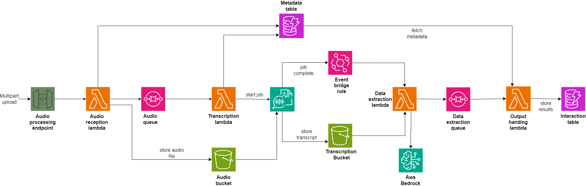

# Customer Service Insights Project

## Overview
The Customer Service Insights project aims to enhance how businesses process and analyze customer service interactions. By integrating various AWS services, this project automates the transcription of audio files and extracts valuable insights, providing businesses with both actionable data and deep analytical capabilities.

## Data Pipeline
The project implements a robust data pipeline designed to handle the entire lifecycle of customer service interactions. This pipeline is built on a serverless framework, leveraging AWS Lambda functions, S3, SQS, and DynamoDB to ensure scalability and reliability. The process begins with the reception of audio files and their metadata, followed by automated transcription using AWS Transcribe. The transcribed text is then analyzed by AWS Bedrock to extract meaningful insights, which are validated and stored in DynamoDB.

## Advanced Analysis
At the heart of this project is the integration of a large language model via AWS Bedrock. This allows for advanced analysis of transcribed text, identifying key elements such as sentiment, action items, and follow-up tasks from customer interactions. This level of analysis goes beyond basic transcription, offering a richer understanding of conversations and enabling more precise responses and strategic improvements.

## Immediate and Long-term Benefits
One of the key benefits of this project is its ability to provide immediate, actionable insights while also generating data for long-term strategic analysis. By capturing detailed information such as customer sentiment and compliance status, businesses can respond more effectively to individual interactions and track performance trends to make data-driven decisions that enhance overall service quality.

## Project Architecture
The architecture of the Customer Service Insights project is illustrated in the diagram below:



## Setup Instructions

1. **Clone the repository**:
   ```sh
   git clone <https://github.com/Syncroth/Customer-Service-Insights.git>
   ```

2. **Set up your environment**:
   Navigate to the project directory and run the setup script.
   ```sh
   cd Customer-Service-Insights
   ./scripts/setup_env.sh
   ```

3. **Deploy the infrastructure**:
   Use the provided deployment script to set up the necessary AWS resources.
   ```sh
   ./scripts/deploy.sh
   ```
